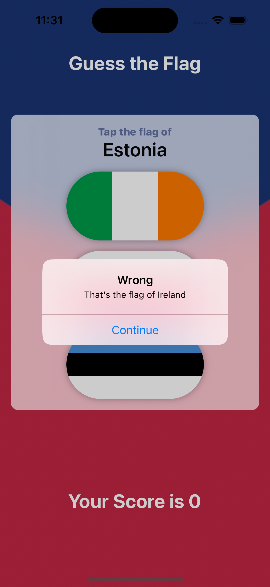
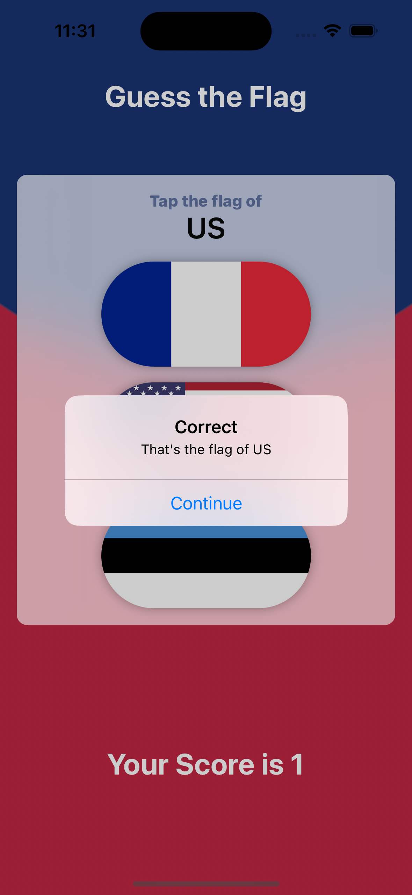
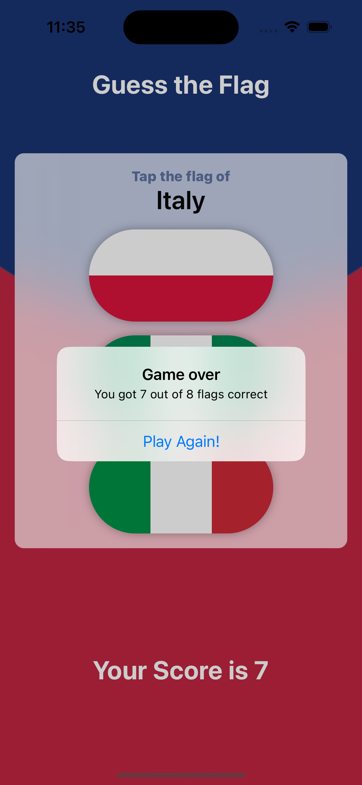

Certainly! Here's an updated version of the README with a clickable link to "Hacking with Swift" and a new section for screenshots:

---

# GuessTheFlag

GuessTheFlag is an engaging iOS game built as part of the Day 20-22 challenges in the ["100 Days of SwiftUI"](https://www.hackingwithswift.com/100/swiftui) tutorial series by [Hacking with Swift](https://www.hackingwithswift.com). This app presents users with three different flags and challenges them to select the correct flag from the options provided. Additionally, it keeps track of the player's score and allows them to reset and play again after completing a round of 8 questions.

## Features

- **Flag Display**: Presents users with three different flags to choose from.
- **Flag Selection**: Prompts users to select the correct flag among the options displayed.
- **Score Tracking**: Keeps track of the player's score as they progress through the game.
- **Round Completion**: Allows users to reset and play again after completing a round of 8 questions.

## How to Play

1. **Flag Selection**: Choose the correct flag from the three options presented.
2. **Score Tracking**: Keep an eye on your score as you answer each question.
3. **Complete the Round**: Try to complete a round of 8 questions to challenge yourself.
4. **Play Again**: After completing a round, reset the game and play again to beat your score!

## Technologies Used

- **SwiftUI**: Utilized for the user interface and game logic.
- **Score Tracking**: Implemented using Swift logic to keep track of the player's performance.
- **Challenge Concepts**: Incorporated concepts from the Day 20-22 challenges in the "100 Days of SwiftUI" tutorial.

## Screenshots

## Getting Started

To run the GuessTheFlag app:
1. Clone this repository.
2. Open the project in Xcode.
3. Build and run the app on a simulator or a physical device.
4. Play the game by selecting the correct flag among the options provided.

## Acknowledgments

- [**Hacking with Swift**](https://www.hackingwithswift.com): Provided the ["100 Days of SwiftUI"](https://www.hackingwithswift.com/100/swiftui) tutorial series that inspired and guided the development of this game.
- **iOS Developer Community**: Resources and discussions that aided in problem-solving during the development process.

